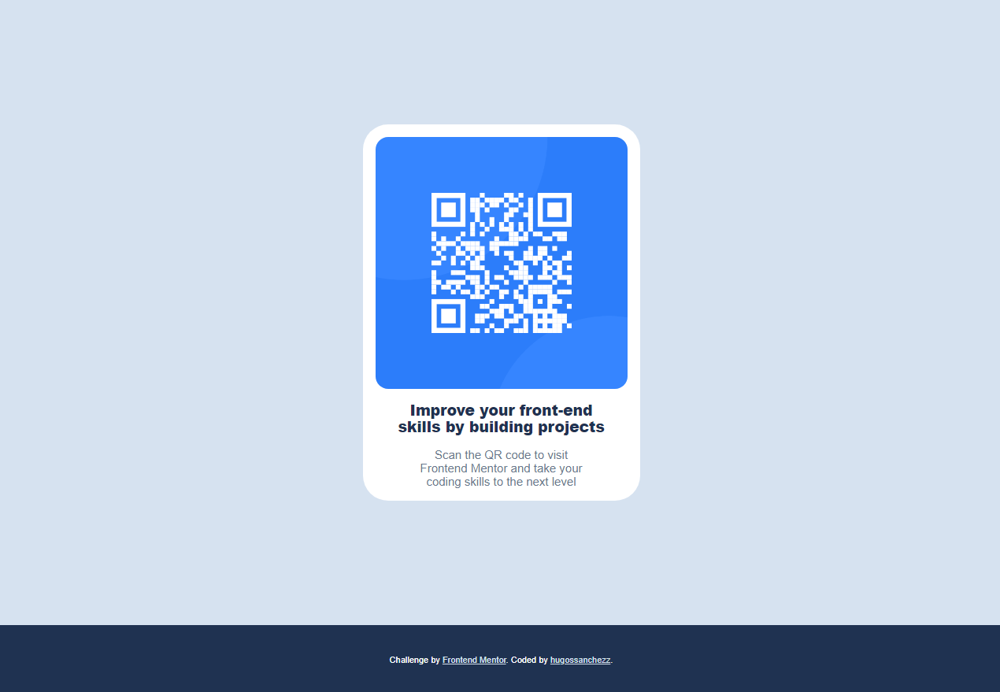

# Frontend Mentor - QR code component solution

Esta es mi solución al reto [QR code component challenge on Frontend Mentor](https://www.frontendmentor.io/challenges/qr-code-component-iux_sIO_H). 

## Table of contents

- [Overview](#overview)
  - [Screenshots](#screenshots)
  - [Links](#links)
- [Author](#author)

## Overview

### Screenshots

Vista en desktop.

Vista en smartphone.

### Links

- [URL al repositorio en GitHub](https://github.com/hugossanchezz/Proyectos/tree/main/FrontendMentor/QR-code-component)
- [URL a la web desplegada](https://qr-card-hugossanchezz.netlify.app/)

## Autor

- Website - [hugossanchezz](https://github.com/hugossanchezz)
- Frontend Mentor - [@hugossanchezz](https://www.frontendmentor.io/profile/hugossanchezz)

